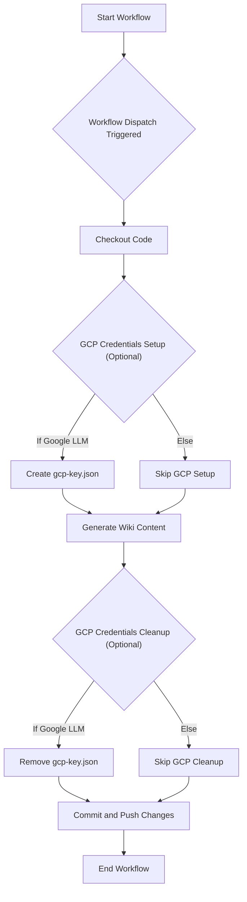
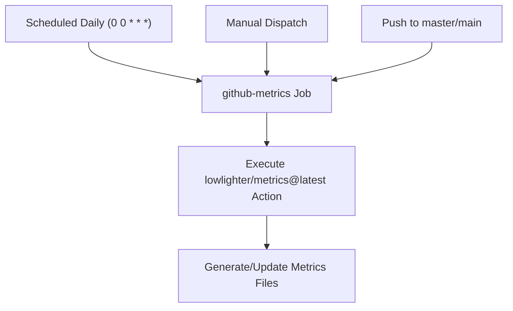

# catuscio's GitHub Profile Wiki

This wiki provides comprehensive documentation for catuscio's personal GitHub profile repository, detailing professional background, technical skills, and repository functionalities.

## Table of Contents

- [Welcome to catuscio's Profile](#welcome-to-catuscio's-profile)
- [About Choi Gyumin](#about-choi-gyumin)
- [Areas of Interest](#areas-of-interest)
- [Career & Activities](#career-&-activities)
- [Technical Skills & Tools](#technical-skills-&-tools)
- [Repository Purpose](#repository-purpose)
- [Wiki-as-README Workflow](#wiki-as-readme-workflow)
- [Metrics Collection Workflow](#metrics-collection-workflow)
- [GCP Key Management](#gcp-key-management)
- [How to Connect](#how-to-connect)

---

Relevant source files

The following files were used as context for generating this wiki page:

- [README.md](README.md)

# Welcome to catuscio's Profile

## Introduction

This wiki page provides a comprehensive overview of "catuscio," also known as Choi Gyumin. It details his professional identity, areas of expertise, career trajectory, academic and extracurricular activities, technical proficiencies, and personal philosophy. The profile serves as a central point of information for understanding his background as an AI Software Engineer, his contributions, and how to connect with him.
Sources: [README.md](general_content)

## Who is catuscio?

catuscio is the online alias for Choi Gyumin, an AI Software Engineer. He identifies as a "Street Smart AI Software Engineer" with a focus on building production-ready Large Language Model (LLM) applications end-to-end. Currently, he is contributing to the development of a Real-time AI Golf Swing Coach at Kaddie (Kimcaddie).
Sources: [README.md](Greetings section)

## Professional Presence and Contact

Choi Gyumin maintains an active online presence across various platforms for professional networking, sharing insights, and collaboration.

| Platform | Link |
|---|---|
| LinkedIn | [https://www.linkedin.com/in/gyumin-choi/](https://www.linkedin.com/in/gyumin-choi/) |
| Coffee Chat | [https://cal.com/catuscio/coffeechat](https://cal.com/catuscio/coffeechat) |
| Notion (Resume) | [https://gyumin-resume.notion.site/Choi-Gyumin-1952ba8ffd4f80a4bbabe09465536ccc?source=copy_link](https://gyumin-resume.notion.site/Choi-Gyumin-1952ba8ffd4f80a4bbabe09465536ccc?source=copy_link) |
| Blog | [https://catuscio-blog.vercel.app/](https://catuscio-blog.vercel.app/) |
| Email | [mailto:catuscio@hotmail.com](mailto:catuscio@hotmail.com) |
Sources: [README.md](header links and How to reach me section)

## Areas of Interests

catuscio's technical interests are broad, focusing on the practical application and deployment of artificial intelligence technologies. His key areas of interest include:
*   Large Language Models (LLM)
*   Agent-based systems
*   Retrieval-Augmented Generation (RAG)
*   Speech-to-speech technologies
*   Python Backend development
*   End-to-end product development
Sources: [README.md](Areas of Interests section)

## Experiences

Choi Gyumin's experience spans professional roles, freelance projects, internships, and significant academic and community activities.

### Career
| Date | Role | Organization |
|---|---|---|
| 2025.11 - Present | AI Engineer | [**Kimcaddie**](https://www.kaddie.golf) |
| 2025.09 - 2025.10 | AI Engineer Lead Freelance | [**Tripgether**](https://www.instagram.com/tripgether_official?igsh=NDRpbHN5Y3NqZWtq) |
| 2025.09 - 2025.10 | LLM Software Engineer Freelance | [**WHATsLab**](https://www.whatslab.co.kr) |
| 2025.03 - 2025.06 | AI Engineer Internship | [**GenON**](https://genon.ai/) |
| 2023.12 - 2024.12 | Undergraduate Research Student | [**IDEAL Lab**](https://ideal.sejong.ac.kr/) |
Sources: [README.md](Experiences - Career section)

### Activities
| Date | Role | Organization |
|---|---|---|
| 2025.08 - Present | Entertainment Team Image Crew Dev | [**Proact0**](https://github.com/Proact0) |
| 2025.01 - Present | Head of Education && AI Track Lead | [**Alom**](https://github.com/alom-sejong) |
| 2024.07 - 2024.08 | Course Trainee | [**LG Aimers/Data Intelligence**](https://www.lgaimers.ai/) |
| 2023.01 - 2024.03 | Staff (Currently Alumni) | [**SMARCLE**](https://www.smarcle.dev/main) |
| 2022.02 - Present | BS in Intelligent Mechatronics Engineering | [**Sejong Univ**](http://imc.sejong.ac.kr/) |
Sources: [README.md](Experiences - Activities section)

## Tech Stacks

catuscio possesses a diverse skill set across programming languages, AI/ML frameworks, backend technologies, DevOps tools, and productivity applications.

### Programming Languages
*   Python
*   C
*   HTML
*   CSS
*   JavaScript

### AI/ML Frameworks & Libraries
*   PyTorch
*   TensorFlow
*   HuggingFace
*   LangChain
*   LangGraph
*   Pydantic
*   Streamlit

### Backend & Web Technologies
*   FastAPI
*   Node.js

### Development & DevOps Tools
*   Git
*   GitHub
*   Docker
*   Google Cloud Platform (GCP)
*   Linux
*   VS Code
*   Visual Studio

### Productivity & Design Tools
*   Notion
*   Figma

... and many more tools and technologies as required for product development.
Sources: [README.md](Tech Stacks section)

## Philosophy

Choi Gyumin operates under a pragmatic and collaborative philosophy:
*   "필요한 일을 찾아서 하자" / "Let's find what needs to be done and do it." - Emphasizes proactivity and problem-solving.
*   "같이 일하기 편한 사람" / "Someone comfortable to collaborate with" - Highlights the importance of teamwork and interpersonal skills.
Sources: [README.md](Philosophy section)

## Conclusion

This profile provides a comprehensive overview of Choi Gyumin (catuscio) as an AI Software Engineer. It showcases his expertise in LLM applications, his diverse technical background, and his commitment to practical, collaborative development. For more detailed information, his Notion resume is available.
Sources: [README.md](general_content)

---

Relevant source files

The following files were used as context for generating this wiki page:

- [README.md](README.md)

# About Choi Gyumin

## Introduction

This wiki page provides a comprehensive overview of Choi Gyumin, also known by the alias "catuscio," a "Street Smart AI Software Engineer." The information presented here details his professional background, areas of expertise, technical proficiencies, career experiences, academic pursuits, and personal philosophy. Choi Gyumin specializes in building production-ready Large Language Model (LLM) applications end-to-end, with a current focus on real-time AI solutions in the golf industry.
Sources: [README.md](lines 1-18)

## Professional Profile

Choi Gyumin identifies as a "Street Smart AI Software Engineer" with a strong focus on practical, end-to-end development of LLM applications. He is currently contributing to the development of a Real-time AI Golf Swing Coach at Kaddie (Kimcaddie).
Sources: [README.md](lines 18-20)

### Areas of Interest

His primary areas of interest and expertise include:
*   Large Language Models (LLM)
*   Agent-based systems
*   Retrieval-Augmented Generation (RAG)
*   Speech-to-speech technologies
*   Python Backend development
*   General product development necessities
Sources: [README.md](lines 24-25)

## Experiences

Choi Gyumin's professional journey encompasses a mix of full-time roles, freelance projects, internships, and research positions, complemented by significant extracurricular activities.

### Career History

| Date | Role |
|---|---|
| 2025.11 - Present | AI Engineer @ [**Kimcaddie**](https://www.kaddie.golf) |
| 2025.09 - 2025.10 | AI Engineer Lead Freelance @ [**Tripgether**](https://www.instagram.com/tripgether_official?igsh=NDRpbHN5Y3NqZWtq) |
| 2025.09 - 2025.10 | LLM Software Engineer Freelance @ [**WHATsLab**](https://www.whatslab.co.kr) |
| 2025.03 - 2025.06 | AI Engineer Internship @ [**GenON**](https://genon.ai/) |
| 2023.12 - 2024.12 | Undergraduate Research Student @ [**IDEAL Lab**](https://ideal.sejong.ac.kr/) |
Sources: [README.md](lines 31-38)

### Activities and Education

| Date | Role |
|---|---|
| 2025.08 - Present | Entertainment Team Image Crew Dev @ [**Proact0**](https://github.com/Proact0) |
| 2025.01 - Present | Head of Education && AI Track Lead @ [**Alom**](https://github.com/alom-sejong) |
| 2024.07 - 2024.08 | Course Trainee @ [**LG Aimers/Data Intelligence**](https://www.lgaimers.ai/) |
| 2023.01 - 2024.03 | Staff (Currently Alumni) @ [**SMARCLE**](https://www.smarcle.dev/main) |
| 2022.02 - Present | BS in Intelligent Mechatronics Engineering @ [**Sejong Univ**](http://imc.sejong.ac.kr/) |
Sources: [README.md](lines 41-48)

## Technical Stacks

Choi Gyumin possesses a diverse set of technical skills, covering programming languages, machine learning frameworks, web frameworks, development tools, and cloud platforms.

*   **Programming Languages:** Python, C, HTML, CSS, JavaScript
*   **Machine Learning & AI Frameworks:** PyTorch, TensorFlow, Hugging Face, LangChain, LangGraph
*   **Web Frameworks & Libraries:** FastAPI, Node.js, Streamlit, Pydantic
*   **Development Tools & Platforms:** Git, GitHub, Docker, GCP (Google Cloud Platform), Linux, Notion, Figma, VS Code, Visual Studio
Sources: [README.md](lines 51-64)

## Philosophy

Choi Gyumin operates under two core philosophies that guide his professional approach:

*   **"필요한 일을 찾아서 하자" / "Let's find what needs to be done and do it."** This emphasizes proactivity and a results-oriented mindset, focusing on identifying and executing necessary tasks.
*   **"같이 일하기 편한 사람" / "Someone comfortable to collaborate with"** This highlights the importance of teamwork, interpersonal skills, and fostering a positive collaborative environment.
Sources: [README.md](lines 68-71)

## Contact Information

Choi Gyumin can be reached through various professional channels:

*   **LinkedIn:** [https://www.linkedin.com/in/gyumin-choi/](https://www.linkedin.com/in/gyumin-choi/)
*   **E-mail:** [catuscio@hotmail.com](mailto:catuscio@hotmail.com)
*   **Coffee Chat:** [https://cal.com/catuscio/coffeechat](https://cal.com/catuscio/coffeechat)
*   **Detailed Resume:** [Notion](https://gyumin-resume.notion.site/AI-Software-Engineer-1952ba8ffd4f80a4bbabe09465536ccc?source=copy_link)
Sources: [README.md](lines 74-80)

## Conclusion

Choi Gyumin is an AI Software Engineer with a strong foundation in LLM application development, a broad technical skill set, and a pragmatic, collaborative philosophy. His experience spans various roles in AI engineering, research, and community leadership, demonstrating a commitment to continuous learning and impactful contributions in the field of artificial intelligence.

---

Relevant source files

The following files were used as context for generating this wiki page:

- [README.md](README.md)

# Areas of Interest

## Introduction
This document outlines the "Areas of Interest" as presented in the project's `README.md` file. This section serves as a concise summary of the technical domains and professional focus areas that the author, catuscio (Choi Gyumin), is actively engaged in or passionate about. It provides a quick overview of the expertise and strategic direction in their work as an AI Software Engineer.
Sources: [README.md](Areas of Interests section)

## Core Areas of Interest
The author's primary areas of interest span several key domains within artificial intelligence and software development, reflecting a focus on building end-to-end, production-ready applications. These interests are directly aligned with modern AI trends and practical software engineering needs.

The identified areas include:
*   **LLM (Large Language Models):** Focus on the development and application of large language models.
*   **Agent:** Interest in AI agents, likely referring to autonomous or semi-autonomous software entities that can perform tasks.
*   **RAG (Retrieval-Augmented Generation):** Expertise and interest in systems that combine information retrieval with generative models to produce more informed and accurate outputs.
*   **Speech-to-speech:** Involvement in technologies that process and generate speech, potentially encompassing speech recognition and synthesis.
*   **Python Backend:** Strong focus on backend development using Python, indicating proficiency in building robust and scalable server-side applications.
*   **Product-Oriented Development:** A broad interest in "everything I need to make product," highlighting a pragmatic, full-stack approach to software development with an emphasis on delivering complete, functional products.

Sources: [README.md](Areas of Interests section)

## Significance
These listed areas collectively represent the author's current technical landscape and professional aspirations. They indicate a profile geared towards developing advanced AI applications, particularly those involving natural language processing, intelligent automation, and robust backend infrastructure. The inclusion of "everything I need to make product" underscores a holistic, solution-oriented mindset, emphasizing the practical application of these technologies to create tangible products.

## Conclusion
The "Areas of Interest" section effectively communicates the technical breadth and strategic focus of the author. It highlights a strong commitment to cutting-edge AI technologies like LLMs, Agents, and RAG, combined with essential software engineering skills in Python backend development, all driven by a product-centric philosophy. This overview is crucial for understanding the author's professional identity and capabilities within the AI software engineering domain.

---

Relevant source files

The following files were used as context for generating this wiki page:

- [README.md](README.md)

# Career & Activities

## Introduction
This wiki page provides a comprehensive overview of Choi Gyumin's (catuscio) professional career, academic activities, areas of interest, and technical proficiencies. It details significant roles held in various organizations, involvement in academic and community groups, and the core technologies utilized in projects and work. The information presented here aims to give a clear picture of the individual's journey and capabilities as an AI Software Engineer.

## Career Experiences
Choi Gyumin's professional journey includes roles as an AI Engineer, AI Engineer Lead, and LLM Software Engineer across various companies and as a freelance contributor. This section outlines the timeline and specific roles undertaken.

| Date | Role |
|---|---|
| 2025.11 - Present | AI Engineer @ [**Kimcaddie**](https://www.kaddie.golf) |
| 2025.09 - 2025.10 | AI Engineer Lead Freelance @ [**Tripgether**](https://www.instagram.com/tripgether_official?igsh=NDRpbHN5Y3NqZWtq) |
| 2025.09 - 2025.10 | LLM Software Engineer Freelance @ [**WHATsLab**](https://www.whatslab.co.kr) |
| 2025.03 - 2025.06 | AI Engineer Internship @ [**GenON**](https://genon.ai/) |
| 2023.12 - 2024.12 | Undergraduate Research Student @ [**IDEAL Lab**](https://ideal.sejong.ac.kr/) |
Sources: [README.md](Career section)

## Activities & Education
Beyond professional roles, active participation in academic research, student organizations, and specialized training programs highlights a commitment to continuous learning and community engagement.

| Date | Role |
|---|---|
| 2025.08 - Present | Entertainment Team Image Crew Dev @ [**Proact0**](https://github.com/Proact0) |
| 2025.01 - Present | Head of Education && AI Track Lead @ [**Alom**](https://github.com/alom-sejong) |
| 2024.07 - 2024.08 | Course Trainee @ [**LG Aimers/Data Intelligence**](https://www.lgaimers.ai/) |
| 2023.01 - 2024.03 | Staff (Currently Alumni) @ [**SMARCLE**](https://www.smarcle.dev/main) |
| 2022.02 - Present | BS in Intelligent Mechatronics Engineering @ [**Sejong Univ**](http://imc.sejong.ac.kr/) |
Sources: [README.md](Activities section)

## Areas of Interest
The primary areas of interest revolve around Artificial Intelligence and software development, with a focus on practical application and end-to-end product development.

*   LLM (Large Language Models)
*   Agent systems
*   RAG (Retrieval-Augmented Generation)
*   Speech-to-speech technologies
*   Python Backend development
*   General product development necessities
Sources: [README.md](Areas of Interests section)

## Technical Stacks
A broad range of technologies and tools are utilized, covering programming languages, AI/ML frameworks, web frameworks, DevOps tools, and productivity applications.

### Programming Languages
*   Python
*   C
*   HTML
*   CSS
*   JavaScript
Sources: [README.md](Tech Stacks section)

### AI/ML Frameworks & Libraries
*   PyTorch
*   TensorFlow
*   Hugging Face
*   LangChain
*   LangGraph
*   Pydantic
*   Streamlit
Sources: [README.md](Tech Stacks section)

### Web Frameworks & Backend
*   FastAPI
*   Node.js
Sources: [README.md](Tech Stacks section)

### Development & DevOps Tools
*   Git
*   GitHub
*   Docker
*   GCP (Google Cloud Platform)
*   Linux
Sources: [README.md](Tech Stacks section)

### Productivity & Design Tools
*   Notion
*   Figma
*   VS Code
*   Visual Studio
Sources: [README.md](Tech Stacks section)

## Philosophy
Two core philosophies guide the approach to work and collaboration:
*   "필요한 일을 찾아서 하자" / "Let's find what needs to be done and do it." - Emphasizes proactivity and problem-solving.
*   "같이 일하기 편한 사람" / "Someone comfortable to collaborate with" - Highlights the importance of teamwork and positive working relationships.
Sources: [README.md](Philosophy section)

## Conclusion
This page summarizes Choi Gyumin's professional and academic journey, showcasing a strong foundation in AI software engineering with practical experience in building LLM applications. The diverse range of experiences, technical skills, and a proactive, collaborative philosophy underscore a commitment to impactful product development. For more detailed information, a comprehensive Notion resume is available.
Sources: [README.md](How to reach me section)

---

Relevant source files

The following files were used as context for generating this wiki page:

- [README.md](README.md)

# Technical Skills & Tools

## Introduction
This document outlines the technical skills, programming languages, frameworks, libraries, and tools utilized by catuscio (Choi Gyumin), as detailed in their personal README.md. It provides a comprehensive overview of the technical proficiencies applied in various software engineering and AI development contexts, emphasizing a "Street Smart AI Software Engineer" approach focused on building production-ready LLM applications end-to-end.
Sources: [README.md](Introduction section), [README.md](Greetings section)

## Core Programming Languages
The foundation of the technical stack includes several widely used programming languages, enabling development across various domains from backend services to web interfaces and system-level programming.

### Overview
| Language | Primary Use Cases |
|---|---|
| `Python` | AI/ML development, backend services, scripting |
| `C` | System-level programming, performance-critical applications |
| `HTML` | Web page structure |
| `CSS` | Web page styling |
| `JavaScript` | Frontend interactivity, web development |
Sources: [README.md](Tech Stacks section)

## AI/ML Frameworks and Libraries
A significant portion of the technical expertise lies in the artificial intelligence and machine learning domain, with a focus on large language models (LLMs) and related technologies.

### Machine Learning Frameworks
*   **PyTorch**: A widely adopted open-source machine learning library for deep learning applications.
*   **TensorFlow**: Another prominent open-source machine learning platform, offering a comprehensive ecosystem of tools, libraries, and community resources.
Sources: [README.md](Tech Stacks section)

### LLM-Specific Libraries and Concepts
*   **LLM (Large Language Models)**: Core understanding and application of large language models.
*   **Agent**: Development and implementation of AI agents.
*   **RAG (Retrieval-Augmented Generation)**: Expertise in building systems that combine retrieval mechanisms with generative models.
*   **Speech-to-speech**: Proficiency in technologies related to speech processing and synthesis.
*   **Hugging Face**: Utilization of the Hugging Face ecosystem for pre-trained models, datasets, and tools.
*   **LangChain**: A framework designed for developing applications powered by language models.
*   **LangGraph**: An extension of LangChain for building robust and stateful multi-actor applications with LLMs.
Sources: [README.md](Areas of Interests section), [README.md](Tech Stacks section)

## Backend and Web Development
Skills extend to building robust backend systems and interactive web applications.

### Backend Frameworks
*   **FastAPI**: A modern, fast (high-performance) web framework for building APIs with Python 3.7+ based on standard Python type hints.
*   **Node.js**: A JavaScript runtime built on Chrome's V8 JavaScript engine, used for building scalable network applications.
Sources: [README.md](Tech Stacks section)

### Frontend Libraries
*   **Streamlit**: A Python library that turns data scripts into shareable web apps.
Sources: [README.md](Tech Stacks section)

## Development Tools and Platforms
A suite of tools and platforms are employed for version control, containerization, cloud deployment, and integrated development environments.

### Version Control and Collaboration
*   **Git**: Distributed version control system for tracking changes in source code during software development.
*   **GitHub**: Web-based platform for version control and collaboration using Git.
Sources: [README.md](Tech Stacks section)

### Containerization and Virtualization
*   **Docker**: Platform for developing, shipping, and running applications in containers.
Sources: [README.md](Tech Stacks section)

### Cloud Platforms
*   **GCP (Google Cloud Platform)**: Experience with Google's suite of cloud computing services.
Sources: [README.md](Tech Stacks section)

### Operating Systems
*   **Linux**: Proficiency in using and developing on Linux-based operating systems.
Sources: [README.md](Tech Stacks section)

### Productivity and IDEs
*   **Notion**: Workspace tool for notes, tasks, wikis, and databases.
*   **Figma**: Web-based vector graphics editor and prototyping tool.
*   **VS Code (Visual Studio Code)**: A lightweight but powerful source code editor.
*   **Visual Studio**: An integrated development environment (IDE) from Microsoft.
Sources: [README.md](Tech Stacks section)

## Conclusion
The technical profile demonstrates a broad and deep skill set, particularly strong in AI/ML development with a focus on LLMs, agents, and RAG systems, complemented by robust backend development capabilities and proficiency in essential development tools and platforms. This comprehensive array of skills enables the end-to-end development of complex software solutions.
Sources: [README.md](Tech Stacks section), [README.md](Areas of Interests section)

---

Relevant source files

The following files were used as context for generating this wiki page:

- [README.md](README.md)

# Repository Purpose

## Introduction
This repository serves as a comprehensive personal portfolio and professional profile for Choi Gyumin, known as "catuscio". Its primary purpose is to showcase his expertise, professional experience, technical skills, and areas of interest as an AI Software Engineer. The repository acts as a central hub for individuals and organizations to learn about his professional background, capabilities, and contact information.

## Core Objective
The main objective of this repository is to present a professional online presence for Choi Gyumin. It functions as a digital resume and a personal branding tool, providing a quick overview of his qualifications and professional journey. It aims to communicate his identity as a "Street Smart AI Software Engineer" focused on building "production-ready LLM applications end-to-end."
Sources: [README.md](Greetings! section)

## Key Information Presented

The repository's `README.md` file is structured to provide various facets of Choi Gyumin's professional identity:

### Professional Summary
The repository immediately introduces Choi Gyumin as a "Street Smart AI Software Engineer" specializing in end-to-end development of production-ready LLM applications. It highlights his current role at Kaddie (Kimcaddie) as building a "world's best Real-time AI Golf Swing Coach."
Sources: [README.md](Greetings! section)

### Areas of Expertise
A dedicated section outlines his primary technical interests and specializations, which include:
*   LLM (Large Language Models)
*   Agent-based systems
*   RAG (Retrieval-Augmented Generation)
*   Speech-to-speech technologies
*   Python Backend development
*   General product development necessities
Sources: [README.md](Areas of Interests section)

### Professional Experience
The repository details both his career roles and academic/extracurricular activities, providing a timeline of his professional development. This includes roles at companies like Kimcaddie, Tripgether, WHATsLab, and GenON, as well as research at IDEAL Lab and involvement in student organizations like Proact0 and Alom.
Sources: [README.md](Experiences section)

### Technical Skills
A comprehensive list of technical proficiencies is presented, utilizing skill icons for clarity. This section covers programming languages, frameworks, libraries, tools, and platforms, demonstrating his breadth of knowledge in:
*   **Programming Languages:** Python, C, HTML, CSS, JavaScript
*   **AI/ML Frameworks:** PyTorch, TensorFlow, Hugging Face
*   **Web Frameworks:** FastAPI, Node.js
*   **DevOps/Cloud:** Git, GitHub, Docker, GCP, Linux
*   **AI-Specific Libraries:** LangChain, LangGraph, Pydantic, Streamlit
*   **Tools:** Notion, Figma, VS Code, Visual Studio
Sources: [README.md](Tech Stacks section)

### Personal Philosophy
The repository includes two core philosophies that guide his work and collaboration:
*   "Let's find what needs to be done and do it."
*   "Someone comfortable to collaborate with."
These statements provide insight into his work ethic and team-oriented approach.
Sources: [README.md](Philosophy section)

### Contact Information
Multiple channels are provided for professional outreach, including:
*   LinkedIn profile
*   Email address
*   A link for scheduling a coffee chat
*   A link to his detailed Notion resume
Sources: [README.md](How to reach me section)

## Conclusion
In summary, this repository serves as a dynamic and accessible professional profile for Choi Gyumin. It consolidates his professional narrative, technical capabilities, and contact details into a single, easily navigable resource, effectively communicating his value as an AI Software Engineer to potential collaborators, employers, and the wider tech community.

---

Relevant source files

The following files were used as context for generating this wiki page:

- [.github/workflows/WIKI-AS-README-AS-ACTION.yml](.github/workflows/WIKI-AS-README-AS-ACTION.yml)
- [README.md](README.md)

# Wiki-as-README Workflow

## Introduction

The "Wiki-as-README Workflow" is an automated process designed to generate and update a project's documentation, specifically a README-like Markdown file, using Large Language Models (LLMs). This workflow is implemented as a GitHub Action, enabling continuous documentation updates directly within the repository. It leverages a custom Docker action (`wiki-as-readme-action`) to interact with various LLM providers, generate content, and then commit the updated file back to the repository. The primary goal is to keep project documentation fresh and comprehensive with minimal manual intervention.

Sources: [.github/workflows/WIKI-AS-README-AS-ACTION.yml](.github/workflows/WIKI-AS-README-AS-ACTION.yml)

## Workflow Definition

The core of this workflow is defined in the `.github/workflows/WIKI-AS-README-AS-ACTION.yml` file. It orchestrates the steps required to generate and commit the documentation.

### Trigger

The workflow is configured to run manually via `workflow_dispatch`. This allows repository maintainers to trigger the documentation generation on demand. A `push` trigger with path exclusions is commented out, indicating a potential future or alternative automated trigger based on code changes, excluding changes to the README or the workflow file itself.

Sources: [.github/workflows/WIKI-AS-README-AS-ACTION.yml](on section)

### Job: `generate-and-commit`

This job is responsible for executing the entire documentation generation and commit process.

*   **Runner Environment**: `ubuntu-latest`
*   **Permissions**: Requires `contents: write` to allow the action to commit changes back to the repository.
*   **Environment Variables**:
    *   `OUTPUT_FILE`: Set to `"LLM_Generated_README.md"`, which is the name of the file that will be created or updated by the workflow.

Sources: [.github/workflows/WIKI-AS-README-AS-ACTION.yml](jobs.generate-and-commit section)

### Workflow Steps

The `generate-and-commit` job consists of several sequential steps:

1.  **Checkout code**:
    *   Uses `actions/checkout@v4` to clone the repository content, making it available for subsequent steps.
    *   Sources: [.github/workflows/WIKI-AS-README-AS-ACTION.yml](steps.Checkout code)

2.  **Create GCP Credentials File (Optional)**:
    *   This step is conditional and only relevant if Google Cloud (Vertex AI) is used as the LLM provider.
    *   It takes the `GCP_KEY` secret and writes it to a file named `gcp-key.json` in the workspace. This file is then used for authentication with Google Cloud services.
    *   Sources: [.github/workflows/WIKI-AS-README-AS-ACTION.yml](steps.Create GCP Credentials File)

3.  **Generate Wiki Content**:
    *   This is the central step where the LLM-powered content generation occurs.
    *   It uses a custom Docker action: `docker://ghcr.io/catuscio/wiki-as-readme-action:latest`.
    *   A variety of environment variables are passed to this action to configure the LLM provider, model, language, output file, and API keys. These are detailed in the Configuration Parameters section.
    *   Sources: [.github/workflows/WIKI-AS-README-AS-ACTION.yml](steps.Generate Wiki Content)

4.  **Remove GCP Credentials File (Optional)**:
    *   This cleanup step removes the `gcp-key.json` file created earlier, ensuring sensitive credentials are not left in the runner environment. It runs `if: always()` to ensure cleanup even if previous steps fail.
    *   Sources: [.github/workflows/WIKI-AS-README-AS-ACTION.yml](steps.Remove GCP Credentials File)

5.  **Commit and Push changes**:
    *   Uses `stefanzweifel/git-auto-commit-action@v5` to commit the newly generated or updated `LLM_Generated_README.md` file.
    *   The commit message is standardized as "docs: ✨Update LLM_Generated_README.md via Wiki-As-Readme Action".
    *   Sources: [.github/workflows/WIKI-AS-README-AS-ACTION.yml](steps.Commit and Push changes)

### Workflow Diagram

The following diagram illustrates the flow of the `generate-and-commit` job:

## Configuration Parameters

The `Generate Wiki Content` step relies on several environment variables to configure its behavior, LLM provider, and authentication.

| Parameter | Description | Example Value | Source |
|---|---|---|---|
| `LANGUAGE` | The language for the generated content. | `"en"` | [.github/workflows/WIKI-AS-README-AS-ACTION.yml](LANGUAGE) |
| `OUTPUT_FILE` | The name of the file to generate/update. | `LLM_Generated_README.md` | [.github/workflows/WIKI-AS-README-AS-ACTION.yml](OUTPUT_FILE) |
| `LLM_PROVIDER` | Specifies the LLM service provider. | `"google"`, `"openai"`, `"anthropic"` | [.github/workflows/WIKI-AS-README-AS-ACTION.yml](LLM_PROVIDER) |
| `MODEL_NAME` | The specific LLM model to use. | `"gemini-2.5-flash"` | [.github/workflows/WIKI-AS-README-AS-ACTION.yml](MODEL_NAME) |
| `GCP_PROJECT_NAME` | (Google only) Your Google Cloud project ID. | `${{ secrets.GCP_PROJECT_NAME }}` | [.github/workflows/WIKI-AS-README-AS-ACTION.yml](GCP_PROJECT_NAME) |
| `GCP_MODEL_LOCATION` | (Google only) The region where the Vertex AI model is hosted. | `${{ secrets.GCP_MODEL_LOCATION }}` | [.github/workflows/WIKI-AS-README-AS-ACTION.yml](GCP_MODEL_LOCATION) |
| `GOOGLE_APPLICATION_CREDENTIALS` | (Google only) Path to the GCP service account key file. | `/github/workspace/gcp-key.json` | [.github/workflows/WIKI-AS-README-AS-ACTION.yml](GOOGLE_APPLICATION_CREDENTIALS) |
| `OPENAI_API_KEY` | (OpenAI only) Your OpenAI API key. | `${{ secrets.OPENAI_API_KEY }}` | [.github/workflows/WIKI-AS-README-AS-ACTION.yml](OPENAI_API_KEY) |
| `ANTHROPIC_API_KEY` | (Anthropic only) Your Anthropic API key. | `${{ secrets.ANTHROPIC_API_KEY }}` | [.github/workflows/WIKI-AS-README-AS-ACTION.yml](ANTHROPIC_API_KEY) |
| `GIT_API_TOKEN` | GitHub token for API interactions (e.g., fetching repository content). | `${{ secrets.GITHUB_TOKEN }}` | [.github/workflows/WIKI-AS-README-AS-ACTION.yml](GIT_API_TOKEN) |

## LLM Provider Integration

The workflow is designed to be flexible with LLM providers. Configuration involves setting `LLM_PROVIDER`, `MODEL_NAME`, and the appropriate API key.

*   **Google Cloud (Vertex AI)**:
    *   `LLM_PROVIDER: "google"`
    *   Requires `GCP_PROJECT_NAME`, `GCP_MODEL_LOCATION`, and `GOOGLE_APPLICATION_CREDENTIALS` (pointing to the `gcp-key.json` file generated in a preceding step).
*   **OpenAI**:
    *   `LLM_PROVIDER: "openai"`
    *   Requires `OPENAI_API_KEY`.
*   **Anthropic**:
    *   `LLM_PROVIDER: "anthropic"`
    *   Requires `ANTHROPIC_API_KEY`.

For non-Google providers, the GCP credential setup and cleanup steps should be removed or commented out.

Sources: [.github/workflows/WIKI-AS-README-AS-ACTION.yml](LLM Provider and Model Settings, API Key Settings sections)

## Output File

The workflow generates or updates a Markdown file named `LLM_Generated_README.md`. This file will contain the content produced by the LLM based on the action's internal logic (which is not detailed in the provided source files but implied by its name "wiki-as-readme-action"). The `README.md` file provided in the context data serves as an example of a typical project README, showcasing personal profiles, experiences, and technical stacks, which could be a target style or content for the generated output.

Sources: [.github/workflows/WIKI-AS-README-AS-ACTION.yml](env.OUTPUT_FILE)

## Conclusion

The Wiki-as-README Workflow provides a robust and automated solution for maintaining up-to-date project documentation using the power of Large Language Models. By integrating directly into GitHub Actions, it streamlines the process of generating READMEs or similar wiki-style content, reducing manual effort and ensuring consistency. Its flexible configuration allows for integration with various LLM providers, making it adaptable to different project needs and preferences.

---

Relevant source files

The following files were used as context for generating this wiki page:

- [.github/workflows/metrics.yml](.github/workflows/metrics.yml)

# Metrics Collection Workflow

## Introduction

The Metrics Collection Workflow is an automated process designed to generate and update project metrics within the repository. This workflow leverages GitHub Actions to periodically collect data and visualize various aspects of the project's activity and statistics. Its primary purpose is to provide up-to-date insights without manual intervention, ensuring that project maintainers and contributors have access to current performance and engagement metrics.

Sources: [.github/workflows/metrics.yml](name: Metrics)

## Workflow Overview

This workflow is defined in `.github/workflows/metrics.yml` and is configured to run under several conditions, ensuring regular updates and on-demand execution. It consists of a single job responsible for executing a third-party GitHub Action to perform the metric generation.

### Workflow Triggers

The workflow is configured to be triggered by three distinct events:

| Trigger | Description |
|---|---|
| `schedule` | The workflow runs daily at midnight UTC (`0 0 * * *`). This ensures regular, automated updates of the metrics. |
| `workflow_dispatch` | Allows for manual triggering of the workflow directly from the GitHub Actions tab in the repository. This is useful for immediate updates or testing. |
| `push` | The workflow is triggered whenever code is pushed to the `master` or `main` branches. This ensures metrics are updated following significant code changes or releases. |

Sources: [.github/workflows/metrics.yml](on)

### Workflow Job: `github-metrics`

The core logic of the metrics collection resides within a single job named `github-metrics`.

#### Job Configuration

*   **Runner Environment**: The job executes on an `ubuntu-latest` virtual machine, providing a standard Linux environment for the action to run.
*   **Environment**: It is associated with an environment named `metrics-token`. This typically indicates that specific environment secrets are required for the job to run, enhancing security by isolating sensitive credentials.
*   **Permissions**: The job is granted `contents: write` permissions. This is crucial as the `lowlighter/metrics` action needs to write generated metric files back to the repository.

Sources: [.github/workflows/metrics.yml](jobs.github-metrics)

#### Steps

The `github-metrics` job contains one primary step:

*   **Action Usage**: It utilizes the `lowlighter/metrics@latest` GitHub Action. This action is a popular tool for generating various types of metrics for GitHub profiles and repositories.
*   **Token Configuration**: The action requires a GitHub token for authentication and API access. This is provided via `token: ${{ secrets.METRICS_TOKEN }}`, which securely fetches the token from the repository's secrets. This token typically needs sufficient permissions to read repository data and write back the generated metric files.

Sources: [.github/workflows/metrics.yml](steps)

### Workflow Flow Diagram

The following diagram illustrates the various triggers and the execution flow of the Metrics Collection Workflow:

## Conclusion

The Metrics Collection Workflow provides an automated and efficient mechanism for maintaining up-to-date project metrics. By leveraging GitHub Actions and the `lowlighter/metrics` tool, it ensures that project insights are regularly refreshed, accessible, and reflect the current state of the repository, triggered by schedules, manual requests, or code pushes.

---

Relevant source files

The following files were used as context for generating this wiki page:

- [gcp-key.json](gcp-key.json)

# GCP Key Management

## Introduction

This document describes the structure and purpose of the Google Cloud Platform (GCP) service account key used within the project. A GCP service account key is a credential file, typically in JSON format, that allows applications or services to authenticate and authorize themselves to GCP APIs without requiring direct user interaction. It acts as a digital identity for non-human entities, enabling secure programmatic access to GCP resources.

The provided `gcp-key.json` file represents such a service account key, specifically configured for the `wiki-as-readme` project. It contains all necessary information for a client to authenticate as the `service-auto-documentation@wiki-as-readme.iam.gserviceaccount.com` service account.

## Service Account Key Structure

The `gcp-key.json` file is a JSON object containing several key-value pairs that define the service account's identity and credentials. Each field plays a crucial role in the authentication process.

Sources: [gcp-key.json](gcp-key.json)

### Key Fields

The following table details the fields found within the `gcp-key.json` file:

| Field | Type | Description |
|---|---|---|
| `type` | `string` | Indicates the type of credential. For service account keys, this is always `"service_account"`. |
| `project_id` | `string` | The unique identifier of the GCP project this service account belongs to. |
| `private_key_id` | `string` | A unique identifier for the private key associated with this service account. |
| `private_key` | `string` | The actual private key in PEM format. This is a highly sensitive piece of information used to cryptographically sign requests. |
| `client_email` | `string` | The email address that uniquely identifies the service account. This is its primary identifier. |
| `client_id` | `string` | A unique numerical ID for the service account. |
| `auth_uri` | `string` | The URI for Google's OAuth 2.0 authorization endpoint. |
| `token_uri` | `string` | The URI for Google's OAuth 2.0 token endpoint, used to exchange authorization grants for access tokens. |
| `auth_provider_x509_cert_url` | `string` | The URL to retrieve the X.509 certificates for Google's OAuth 2.0 provider. |
| `client_x509_cert_url` | `string` | The URL to retrieve the X.509 certificate for this specific service account. |
| `universe_domain` | `string` | Specifies the Google Cloud universe domain, typically `"googleapis.com"`. |

## Usage and Authentication Flow

This service account key is primarily used by applications or services to authenticate to GCP. The typical flow involves:

1.  **Loading the Key:** An application loads the `gcp-key.json` file.
2.  **Credential Initialization:** Using a GCP client library (e.g., Google Cloud Client Libraries for Python, Java, Node.js), the application initializes credentials using the loaded key.
3.  **Token Request:** The client library uses the `private_key` to sign a JSON Web Token (JWT) assertion. This assertion is then sent to the `token_uri` to request an OAuth 2.0 access token.
4.  **API Calls:** The obtained access token is then included in the `Authorization` header of subsequent API requests to GCP services. This token grants the application the permissions assigned to the `service-auto-documentation@wiki-as-readme.iam.gserviceaccount.com` service account.

This mechanism allows automated processes to interact with GCP resources (like Cloud Storage, BigQuery, Compute Engine, etc.) securely and without manual intervention.

## Security Considerations

The `private_key` within `gcp-key.json` is highly sensitive. If compromised, an attacker could impersonate the service account and gain access to all GCP resources that the service account has permissions for. Therefore, it is critical to:

*   **Secure Storage:** Store the key file securely, ideally in a secrets management system (e.g., Google Secret Manager, HashiCorp Vault) rather than directly in source code repositories.
*   **Least Privilege:** Ensure the service account associated with this key has only the minimum necessary permissions required to perform its intended tasks.
*   **Rotation:** Regularly rotate service account keys to mitigate the impact of potential compromises.

## Conclusion

The `gcp-key.json` file is a fundamental component for enabling secure, programmatic access to Google Cloud resources within the `wiki-as-readme` project. It encapsulates the identity and cryptographic material necessary for the `service-auto-documentation` service account to authenticate with GCP APIs. Understanding its structure and proper handling is crucial for maintaining the security and functionality of applications interacting with Google Cloud.

---

Relevant source files

The following files were used as context for generating this wiki page:

- [README.md](README.md)

# How to Connect

## Introduction
This document outlines the various methods available to connect with Choi Gyumin, also known as "catuscio," the author and maintainer of this profile/project. These connection points facilitate professional networking, collaboration inquiries, and general communication, providing direct channels for engagement as well as access to more detailed professional information.

## Connection Channels

The primary methods for establishing contact or accessing further professional details are detailed below.

### Direct Communication

For direct inquiries, professional networking, or informal discussions, the following channels are provided:

#### LinkedIn
LinkedIn serves as the primary professional networking platform. It is suitable for professional connections, endorsements, and direct messaging related to career opportunities or collaborations.
*   **Link:** [https://www.linkedin.com/in/gyumin-choi/](https://www.linkedin.com/in/gyumin-choi/)
*   **Purpose:** Professional networking, career inquiries, direct messaging.
Sources: [README.md](How to reach me section)

#### E-mail
For formal communications, detailed inquiries, or attachments, direct email is available.
*   **Address:** `catuscio@hotmail.com`
*   **Purpose:** Formal correspondence, detailed questions, document exchange.
Sources: [README.md](How to reach me section)

#### Coffee Chat
An informal meeting can be scheduled for discussions, mentorship, or general networking over a virtual coffee. This is ideal for less formal conversations and exploring potential synergies.
*   **Scheduling Link:** [https://cal.com/catuscio/coffeechat](https://cal.com/catuscio/coffeechat)
*   **Purpose:** Informal discussions, mentorship, networking.
Sources: [README.md](How to reach me section)

### Professional Portfolio and Detailed Information

For a comprehensive overview of professional experience, projects, and skills, the following resource is available:

#### Notion Profile
A detailed Notion page serves as a comprehensive resume and portfolio, offering in-depth information about professional background, projects, and achievements. It is recommended for those seeking a complete understanding of the author's capabilities and history.
*   **Link:** [https://gyumin-resume.notion.site/AI-Software-Engineer-1952ba8ffd4f80a4bbabe09465536ccc?source=copy_link](https://gyumin-resume.notion.site/AI-Software-Engineer-1952ba8ffd4f80a4bbabe09465536ccc?source=copy_link)
*   **Purpose:** Detailed resume, project portfolio, comprehensive professional overview.
Sources: [README.md](How to reach me section)

## Conclusion
Connecting with Choi Gyumin can be achieved through various dedicated channels, each suited for different types of interaction. Whether seeking direct communication via LinkedIn or email, an informal chat, or a deep dive into professional history through the Notion profile, appropriate avenues are provided to facilitate engagement.

---
