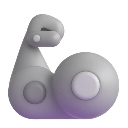

<h2 align="center">
    catuscio (Choi Gyumin)
</h2>

    
    
    
    
    

##  Greetings!
> _**Street Smart AI Software Engineer.**_

I make production-ready LLM applications end-to-end.\
Currently building world's best Real-time AI Golf Swing Coach at **Kaddie (Kimcaddie)**

##  Areas of Interests
LLM, Agent, RAG, Speech-to-speech, Python Backend, and everything I need to make product.

##  Experiences
### Career 💼
| Date | Role |
|--|--|
| 2025.11 - Present | AI Engineer @ [**Kimcaddie**]([https://kimcaddie.career.greetinghr.com/ko/corp](https://www.kaddie.golf)) |
| 2025.09 - 2025.10 | AI Engineer Lead Freelance @ **Tripgether** |
| 2025.09 - 2025.10 | LLM Software Engineer Freelance @ [**WHATsLab**](https://www.whatslab.co.kr) |
| 2025.03 - 2025.06 | AI Engineer Internship @ [**GenON**](https://genon.ai/) |
| 2023.12 - 2024.12 | Undergraduate Research Student @ [**IDEAL Lab**](https://ideal.sejong.ac.kr/) |

### Activities 🎒
| Date | Role |
|--|--|
| 2025.08 - Present | Entertainment Team Image Crew Dev @ [**Proact0**](https://github.com/Proact0) |
| 2025.01 - Present | Head of Education && AI Track Lead @ [**Alom**](https://github.com/alom-sejong) |
| 2024.07 - 2024.08 | Course Trainee @ [**LG Aimers/Data Intelligence**](https://www.lgaimers.ai/)
| 2023.01 - 2024.03 | Staff (Currently Alumni) @ [**SMARCLE**](https://www.smarcle.dev/main) |
| 2022.02 - Present | BS in Intelligent Mechatronics Engineering @ [**Sejong Univ**](http://imc.sejong.ac.kr/) |

##  Tech Stacks
\
\
\

... and many more!

##  Philosophy
> "필요한 일을 찾아서 하자"\
> "Let's find what needs to be done and do it."

> "같이 일하기 편한 사람"\
> "Someone comfortable to collaborate with"

##  How to reach me
🌏**LinkedIn**: \
📧**E-mail**: \
☕**Coffee chat**: 

 For detailed information, please refer to my <a href="https://gyumin-resume.notion.site/AI-Software-Engineer-1952ba8ffd4f80a4bbabe09465536ccc?source=copy_link">Notion</a>🤗 

